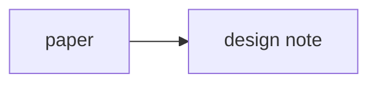

# Obsidian Slow Start

This vault only uses a few Obsidian features on purpose.

## Feature 1: links

Internal links look like `[[PPLNS Glossary]]`.

Why they matter here:

- They keep theory, design, and journal notes connected.
- They let you move without folder hunting.
- They make the graph view useful later.

## Feature 2: backlinks

Open a note, then look at the Backlinks pane.

This is useful when:

- a term in [[PPLNS Glossary]] is referenced from many design notes
- a paper note starts feeding multiple implementation notes
- you want to see where a decision came from

## Feature 3: properties

The block at the top of a note between `---` lines is note metadata.

We are only using a little of it:

- `type`
- `status`
- `tags`

That is enough to learn the feature without turning the vault into a database.

## Feature 4: graph view

Do not worry about the graph yet.

Later, it will be useful for noticing:

- which concepts are central
- which notes are still isolated
- whether the crate design is grounded in the paper or drifting away from it

## Feature 5: diagrams

Obsidian supports Mermaid diagrams directly inside Markdown.

That is useful here because we can sketch:

- payout flows
- crate layers
- paper-to-design mappings

The syntax looks like this:

## A simple work rhythm

For each session:

1. Start at [[Start Here]].
2. Open [[Projects]].
3. Pick the project hub you want to work from.
4. Add one thing you learned to that project's journal.
5. If a term feels fuzzy, make or update a concept note.
6. If a design decision comes from a source, link it back to the source note.

## What we are not doing yet

- plugins
- canvases
- advanced queries
- automated templates
- fancy dashboards

Those can wait until the note habit feels natural.
