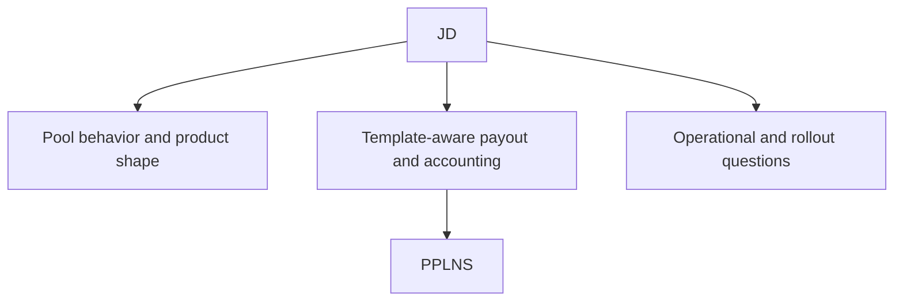

# JD

This note is the project hub for ideas around how [[SRI Production Pool]] will do Job Declaration.

## Parent context

- [[SRI Production Pool]]
- [[SRI Contributor Work]]

## Why this matters

Job Declaration is one of the key selling points of Stratum V2.

For the production pool effort, JD is not just a protocol checkbox. It is part of the larger question:

How should SRI Production Pool support miner-selected templates in a way that is practical, compelling, and aligned with the goal of more decentralized bitcoin mining?

## Goal

Organize ideas about how SRI Production Pool should approach Job Declaration at a high level before sinking into implementation details.

## Scope

This project should hold thoughts about:

- why JD matters for SRI Production Pool
- what a JD-enabled pool mode should look like
- what product, protocol, and operational constraints matter
- what dependencies JD creates for payout and accounting

## Relationship to other projects

### [[PPLNS]]

PPLNS sits under this lane as the payout and share-accounting project most relevant to future pooled JD support.

If SRI Production Pool eventually supports pooled JD, then template-aware payout and accounting become part of the problem.

### [[OpenClaw]]

OpenClaw is adjacent but separate.

It is about operations and agent assistance, not the protocol or payout mechanics of JD itself.

## Visual map

## Current questions

- what JD mode should mean in the context of SRI Production Pool
- where JD support stops being "solo pool plus extras" and becomes a pooled-mining system
- which parts of the JD story belong in the pool itself versus surrounding modules
- what can remain future-facing without blocking near-term pool goals

## What belongs here

- high-level architecture thoughts
- feature framing
- relationship to payout design
- protocol and product questions

## What does not belong here

- low-level payout formulas
- detailed Rust API sketches
- operations automation details

Those belong in more specific child or sibling notes.

## Next smallest step

Create the first JD design note describing what "JD on SRI Production Pool" should mean before deciding how it should be implemented.

Related notes: [[SRI Production Pool]], [[PPLNS]], and [[OpenClaw]]
