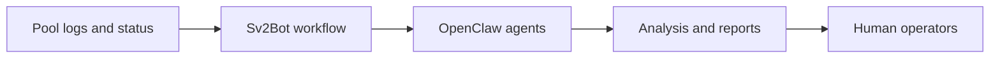

# OpenClaw

This note captures the OpenClaw subproject under [[SRI Production Pool]].

Source note: `/Users/plebhash/sri_production_pool.md`

## Role in the bigger picture

OpenClaw is not core mining logic.

It is the operations and agent-assistance layer around the production pool effort.

## Current framing from the slides

The slide deck frames this around:

- maintaining a mainnet VPS SRI solo pool
- detailed analysis and reports on crashes
- a chat-oriented operational workflow
- periodic reporting

The slides also frame this in terms of `Sv2Bot`, which appears to be the practical interface for using OpenClaw around the pool.

## High-level system view

## Why it matters

If the production pool is a real operational system, then reliability, crash analysis, and concise human-facing reports matter.

This subproject is the part of the vault that can hold those operational and agentic design thoughts without mixing them into payout math.

## Stable design themes

- keep the operator loop tight
- prefer summaries and reports over constant noise
- treat automation as support, not authority
- isolate security-sensitive concerns clearly

## Security note

The slides call out prompt injection as a serious concern.

That means this subproject should keep a strong distinction between:

- trusted instructions
- untrusted operational data such as logs or external content

## Current boundaries

This note should hold:

- high-level purpose
- workflow ideas
- operational concerns
- security notes

This note should not hold:

- exact model assignments
- short-lived vendor details
- low-level implementation until the actual integration work starts

Related notes: [[SRI Production Pool]] and [[SRI Contributor Work]]
