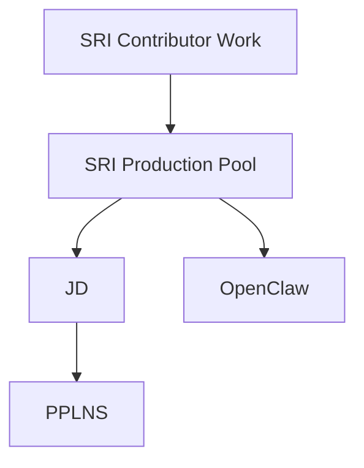

# Projects

This note is the project index for the vault.

## Active

- [[SRI Contributor Work]]

## Current hierarchy

## How to use this note

When a new topic becomes substantial, decide whether it is:

- a new umbrella project
- a child project under an existing umbrella
- just a note, not a project

Right now, the vault treats `SRI Contributor Work` as the umbrella and organizes children underneath it.

A good project hub usually links to:

- its canonical references
- its glossary or key concepts
- its design notes
- its journal or decision log
