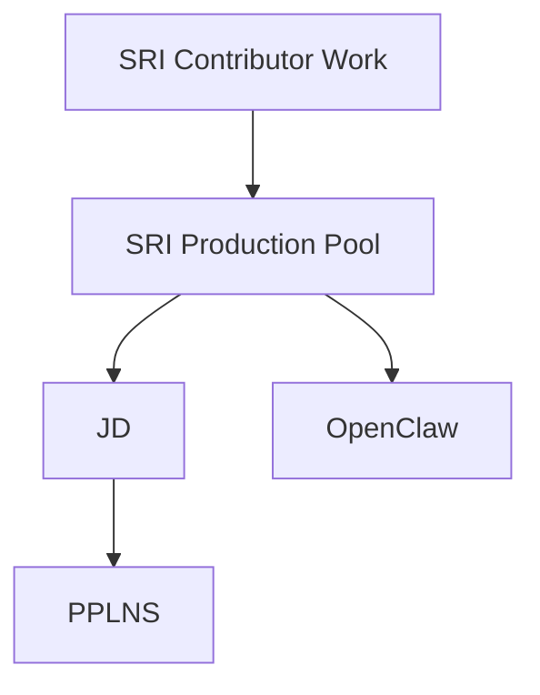

# SRI Contributor Work

This note is the umbrella project for the fronts I am working on as a contributor to the Stratum V2 Reference Implementation.

## Why this note exists

The vault should not treat each effort as isolated.

This note gives a high-level place to organize:

- production-pool work
- protocol-adjacent design efforts
- operational tooling
- future subprojects that do not justify a separate top-level area yet

## Current hierarchy

## Active child projects

- [[SRI Production Pool]]

## Notes on scope

This is intentionally broad and lightweight.

If another front becomes substantial, it can become another child note under this umbrella.

Related notes: [[Projects]], [[SRI Production Pool]], [[JD]], [[PPLNS]], and [[OpenClaw]]
