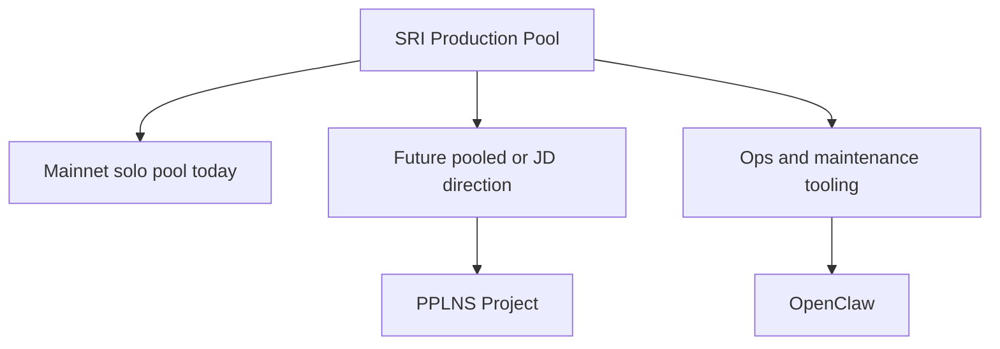

# SRI Production Pool

This note captures the high-level project around running a production-grade Sv2 pool effort.

Source note: `/Users/plebhash/sri_production_pool.md`

## Current framing

From the slide deck, the project is framed around:

- finding real mainnet blocks with Sv2
- operating a mainnet SRI pool in a real-world setting
- proving reliability and usefulness through production usage

At the moment, the slides frame this mostly as a mainnet solo-pool effort.

## Why this matters

This project feels like the bridge between:

- protocol work
- production operations
- future pooled-mining features

It is also the note that explains why some subprojects exist even if they are not immediate priorities.

## Subprojects

### 1. [[PPLNS Project]]

This is the future-facing payout and share-accounting lane.

The slides explicitly say that JD-style pooled mining would require share accounting and non-custodial payouts, and that this is a non-trivial scope and not the immediate priority.

That makes the PPLNS crate a valid umbrella subproject here, even if it is not the first thing to ship.

### 2. [[OpenClaw]]

This is the operations and AI-agent lane.

The slides frame it as part of the support system around maintaining a mainnet VPS SRI pool, reporting on crashes, and producing analysis or summaries.

## Visual map

## Current interpretation

My current reading is:

- the production pool is the practical operational effort
- PPLNS is a future accounting and payout capability under that umbrella
- OpenClaw is an operational support capability under that umbrella

## What belongs here

- project intent
- project boundaries
- relationship between subprojects
- high-level decisions and priorities

## What does not belong here

- deep payout math
- detailed API design
- low-level automation prompts

Those should live in the subproject notes.

Related notes: [[SRI Contributor Work]], [[PPLNS Project]], and [[OpenClaw]]
