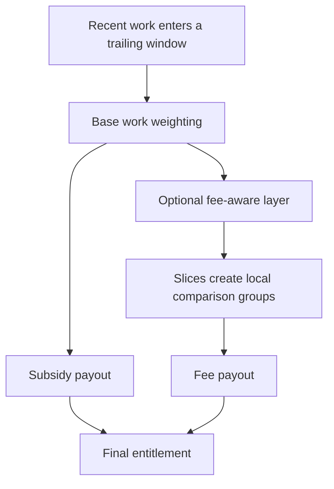
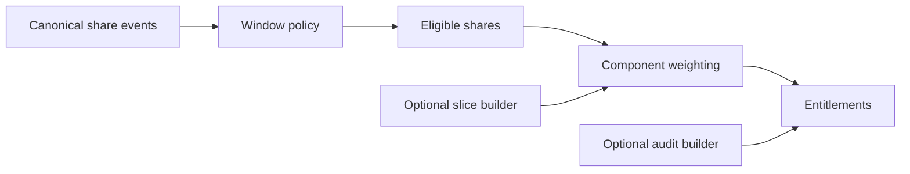

# PPLNS and SLICE Distillation

This note extracts the notions we want to carry from both papers into the crate design.

Canonical sources:

- [[Rosenfeld 2011 - Analysis of Bitcoin Pooled Mining Reward Systems]]
- [[Bonazzi Merli 2024 - PPLNS with Job Declaration]]

## Shared question

How do we reward miners fairly for recent contribution without creating easy strategic exploits?

## What Rosenfeld contributes

Rosenfeld contributes the base payout intuition:

- trailing-window accounting
- expected-value fairness per share
- variance versus maturity tradeoff
- resistance to round-age exploitation
- difficulty-aware accounting through unit-PPLNS

In short:

Rosenfeld tells us how to think about the window.

## What Bonazzi and Merli contribute

Bonazzi and Merli contribute the decentralized-template extension:

- separate subsidy from fee payout
- compare fee value locally, not across the whole window
- define slices as fee-comparable regions
- preserve auditability through published slice artifacts

In short:

Bonazzi and Merli tell us how to think about revenue quality inside the window.

## The combined mental model

The papers fit together cleanly if we think in layers:

## Core notions to preserve

### 1. Work is a first-class input

Every share must carry a contribution measure.

The crate should not hardcode one single interpretation too early. It should be able to support:

- fixed share count
- difficulty-weighted work
- unit-style work accounting

### 2. The window is a policy

The crate should understand the idea of an eligible trailing region, but not hardcode a single window rule.

Candidate policies:

- last `N` shares
- last `X` work units
- difficulty-multiple lookback

### 3. Rewards are components

A block reward is not a single monolith anymore.

The design should let us express:

- subsidy
- transaction fees
- other template-derived revenue inputs, if the caller has a reason to model them explicitly

### 4. Weighting is component-specific

Different reward components may be distributed with different policies.

Example:

- subsidy uses work-only weighting
- fees use slice-local fee-aware weighting

### 5. Auditability is part of the design

In decentralized mining, the accounting story is not complete unless participants can verify the accounting inputs.

That means:

- deterministic input formats matter
- canonical ordering matters
- optional proof artifacts matter

## What this means for the crate

The crate should probably not be "a PPLNS implementation" in the narrow sense.

A better framing is:

A deterministic share-accounting engine with PPLNS-style window policies and optional SLICE-style reward extensions.

## High-level architecture implication

## Current design bias

- keep the base crate small
- keep SLICE as an extension layer
- keep settlement and protocol behavior outside the crate
- make the output "entitlements" rather than "payments"

## Tensions to watch

- Rosenfeld's unit language and Bonazzi or Merli's difficulty language are not identical
- P2PoolV2 may need stricter determinism than a typical pool module
- template value is a protocol input, not something the crate should infer from the network

Related notes: [[PPLNS Glossary]], [[SLICE Visuals]], [[Payout Crate Architecture]], and [[PPLNS Rust Crate]]
