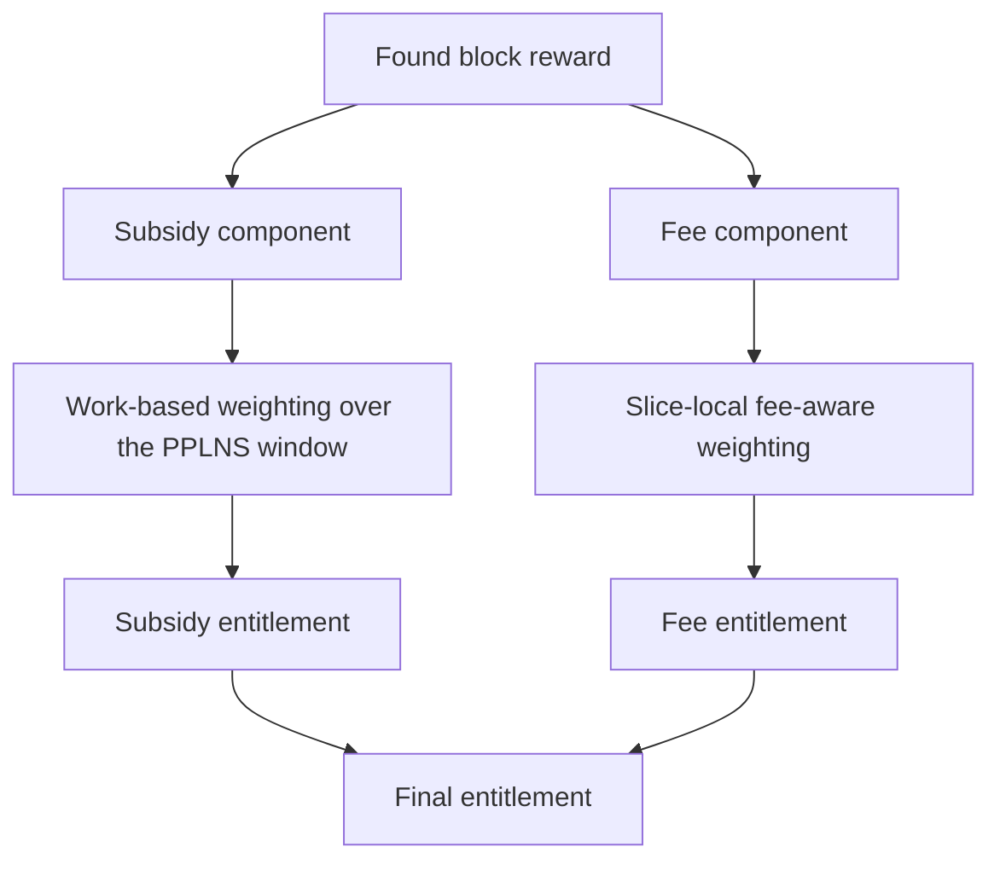
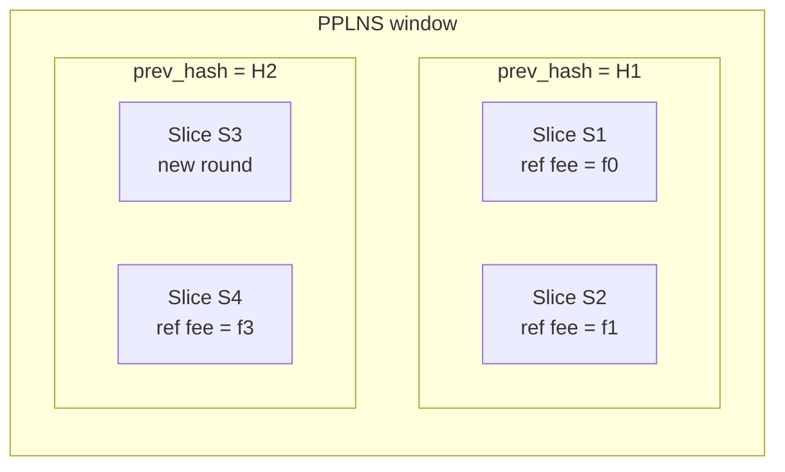
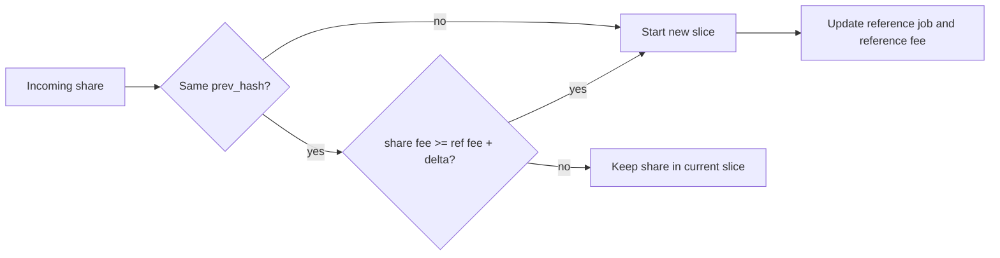
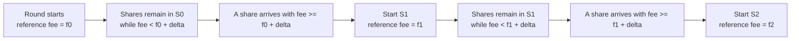
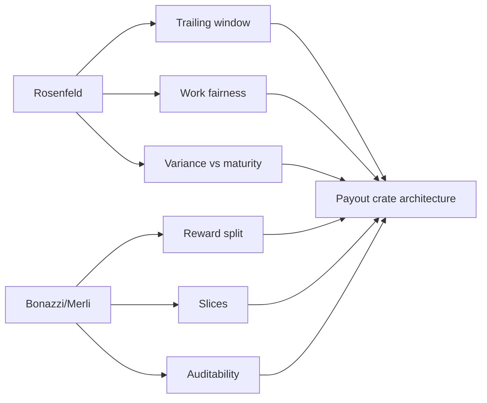

# SLICE Visuals

This note collects visual aids for understanding SLICE and recreates the main ideas in Mermaid.

External references:

- [Delving Bitcoin post 31](https://delvingbitcoin.org/t/pplns-with-job-declaration/1099/31?u=plebhash)
- [Delving Bitcoin post 40](https://delvingbitcoin.org/t/pplns-with-job-declaration/1099/40?u=plebhash)

What those posts contribute:

- a reward decomposition view
- a slice grouping view
- an MMEF-growth view with clearer `delta` steps

## Interpretation note

These diagrams are design aids, not normative protocol text.

The canonical semantics still come from:

- [[Rosenfeld 2011 - Analysis of Bitcoin Pooled Mining Reward Systems]]
- [[Bonazzi Merli 2024 - PPLNS with Job Declaration]]

## 1. Reward decomposition

This is the most important visual shift from plain PPLNS to SLICE.

## 2. Slices inside a broader PPLNS window

The PPLNS window is the full eligible trailing region.

Slices are smaller local comparison groups inside that region.

Reading rule:

- the window may span multiple rounds
- a slice must not cross a `prev_hash` boundary
- a slice is smaller than the whole window

## 3. When a new slice starts

This is the operational decision rule from Bonazzi and Merli.

## 4. MMEF intuition with delta steps

The point of slices is that fee opportunity grows through time, so fee comparison should stay local.

This is the qualitative picture behind the updated MMEF visual from the Delving thread.

## 5. Where each paper fits

## Suggested use in the vault

- use this note when the paper text feels too dense
- link back to it from architecture notes
- refine diagrams as the crate API becomes more concrete

Related notes: [[PPLNS and SLICE Distillation]], [[Payout Crate Architecture]], and [[PPLNS]]
