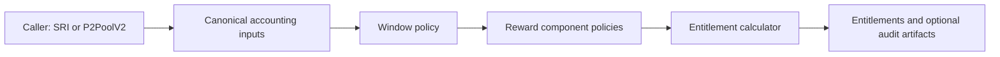
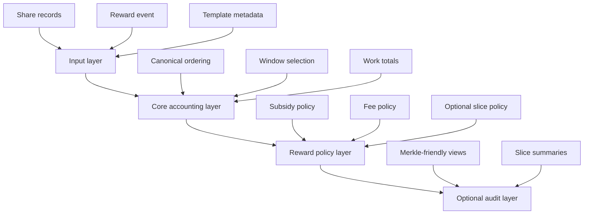
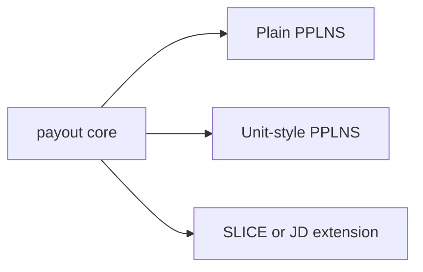

# Payout Crate Architecture

This note documents the architecture of the payout crate as a reusable accounting module.

Project context:

- the crate is a module-level dependency, not a pool implementation
- it should be usable by the Stratum V2 Reference Implementation and by P2PoolV2
- it should support plain PPLNS first and leave room for SLICE-style extensions

Sources:

- [[Rosenfeld 2011 - Analysis of Bitcoin Pooled Mining Reward Systems]]
- [[Bonazzi Merli 2024 - PPLNS with Job Declaration]]
- [[PPLNS and SLICE Distillation]]
- [[SLICE Visuals]]

## Mission

Given a canonical stream of share and block-related inputs, compute deterministic payout entitlements.

## Non-goals

This crate should not own:

- network protocol handling
- database persistence
- mempool inspection
- template construction
- coinbase construction
- payout settlement
- sharechain fork choice
- market-maker logic

## Architectural picture



## Design principle

The crate should compute:

- who is eligible
- how much weight each eligible contribution has
- how each reward component is split

The crate should not decide:

- when money is actually paid
- how outputs are encoded on chain
- how a protocol reaches consensus on the input stream

## Layered model



## Core data model

The core should be explicit and extensible.

```rust
struct ShareId(u64);
struct ActorId(Vec<u8>);
struct JobId(Vec<u8>);

struct ShareRecord<Work, Value> {
    id: ShareId,
    actor: ActorId,
    sequence: u64,
    prev_hash: [u8; 32],
    work: Work,
    template_value: Option<Value>,
    job_id: Option<JobId>,
}

struct RewardEvent<Value> {
    sequence: u64,
    subsidy: Value,
    fees: Value,
}
```

The important parts are:

- canonical ordering is explicit
- work contribution is explicit
- template value is optional
- Job Declaration metadata is optional

## Core abstractions

### 1. Window policy

This answers:

Which shares are eligible for this reward event?

Candidate window policies:

- fixed number of shares
- fixed amount of work
- difficulty-multiple lookback

### 2. Reward components

This answers:

What budgets are being distributed?

Minimum model:

- subsidy
- fees

Possible future model:

- subsidy
- transaction fees
- other explicitly modeled template-derived revenue

### 3. Weight policy

This answers:

How is a reward component split among eligible shares?

Examples:

- subsidy can use work-only weighting
- fees can use work-only weighting in plain PPLNS
- fees can use slice-local fee-aware weighting in SLICE

### 4. Audit projection

This answers:

What verifiable artifacts can the caller derive from the accounting process?

Examples:

- ordered eligible shares
- slice summaries
- Merkle-friendly leaf payloads

## Separation between PPLNS core and SLICE extension

The cleanest architecture is:



Where the core owns:

- canonical share representation
- window selection
- work-based entitlement calculation
- reward decomposition

And the SLICE extension owns:

- slice formation
- reference-job tracking
- local fee comparison
- fee-aware weighting
- optional slice audit artifacts

## Feature strategy

Recommended feature split:

- `core`
  - deterministic accounting
  - plain PPLNS
  - generic reward components
- `slice-jd`
  - slice builder
  - fee-aware weighting
  - Job Declaration metadata helpers
- `audit`
  - slice summaries
  - Merkle helpers
  - proof-friendly views

My current bias is that `slice-jd` should be feature-gated.

The reason is not that SLICE is too hard. The reason is that:

- not every caller needs template-aware payout
- the share model gets larger
- audit and JD metadata increase surface area

## Why this can serve both SRI and P2PoolV2

This crate is compatible with both if it stays headless.

For SRI:

- `pool_sv2` can provide canonical share and reward events
- the crate returns entitlement data to the pool module

For P2PoolV2:

- the sharechain logic can provide canonical share ordering
- the crate returns entitlement data for whatever settlement or coinbase logic sits above it

The shared denominator is deterministic accounting, not common deployment shape.

## Determinism requirements

If P2PoolV2 is a target, the core should assume stricter accounting discipline.

That suggests:

- avoid floating point in accounting-critical paths
- make ordering explicit instead of inferred
- make policy parameters serializable
- make outputs reproducible from the same inputs

## First implementation slice

The first version should stay narrow:

1. one canonical `ShareRecord`
2. one work-based trailing window policy
3. one reward event split into subsidy and fees
4. one plain PPLNS weighting rule
5. deterministic entitlement output

Then:

1. add unit-style window support
2. add pending-reward helpers
3. add `slice-jd`
4. add audit projection helpers

## Open questions

- what numeric type should represent work and value
- should the crate expose policy traits or enums first
- how should partial-slice inclusion behave if the window cuts through a slice
- should audit projections live in the same crate or a companion crate

## Current recommendation

Build the crate as a deterministic accounting kernel.

Treat:

- PPLNS as the base work-allocation layer
- SLICE as an optional fee-allocation layer
- SRI and P2PoolV2 as adapters that provide canonical inputs and consume entitlements

Related notes: [[PPLNS Rust Crate]], [[PPLNS and SLICE Distillation]], [[SLICE Visuals]], and [[Implementation Journal]]
