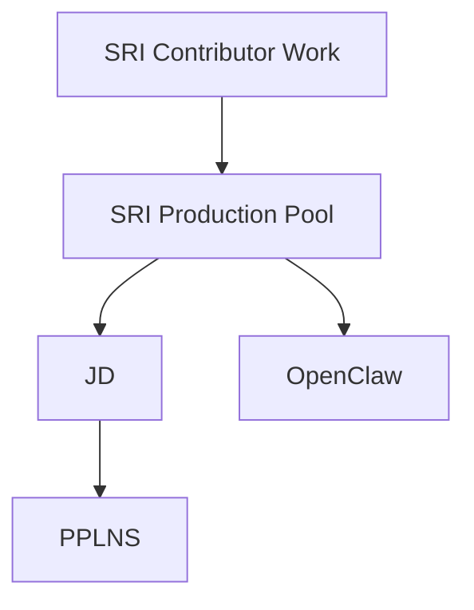

  

<h1 align="center">plebhash-vault</h1>

  <strong>A sanctuary for work ideas.</strong>

  <em>Projects. Papers. Architecture. Durable ideas.</em>

  Long-lived technical thinking for projects, papers, architecture, and strange useful ideas.

  Built and tended by <strong>plebhash</strong>.

  Mission: <strong>decentralize and democratize bitcoin mining</strong>.

---

This repository, <code>plebhash-vault</code>, is plebhash's Obsidian vault for projects, papers, architecture notes, journals, and long-lived technical thinking. It is meant to help work move across multiple fronts without losing the thread between ideas.

At the highest level, this vault exists in service of one larger mission: decentralizing and democratizing bitcoin mining.

The vault is especially useful as a design source:

- for active engineering work
- for paper distillation
- for project hierarchy and context
- for architecture notes that should stay grounded over time

## North Star

The north star of this vault is simple:

Make bitcoin mining more decentralized, more democratic, more legible, and more accessible.

In practice, that means favoring work that helps:

- reduce unnecessary centralization
- expand miner choice and agency
- improve open infrastructure and interoperability
- make difficult systems easier to understand and operate
- keep technical design tied to human and network resilience

## Start Here

If you are opening this repo fresh, start with:

1. [00 Home/Start Here.md](00%20Home/Start%20Here.md)
2. [10 Meta/Obsidian Slow Start.md](10%20Meta/Obsidian%20Slow%20Start.md)
3. [15 Projects/Projects.md](15%20Projects/Projects.md)

## Current Project Map

## Vault Principles

- Keep notes lightweight.
- Prefer links over over-organization.
- Let structure emerge as projects grow.
- Keep source material close to design notes.
- Use the vault as a calm place to think before implementing.

## Folder Spine

The numbered folders are intentional. They give the vault a stable top-level order while leaving room for growth.

- `00 Home/` - entry points and navigation
- `10 Meta/` - notes about how the vault works
- `15 Projects/` - project hubs and hierarchy
- `20 Papers/` - paper notes and source distillations
- `30 Concepts/` - glossary notes, visuals, and shared concepts
- `40 Build/` - architecture and implementation design
- `50 Journal/` - ongoing learning and decision breadcrumbs

## Current Focus

Right now, a major thread in the vault is work around the Stratum V2 Reference Implementation, especially:

- the broader `SRI Production Pool` effort
- `JD` as the lane for thinking through Job Declaration on SRI Production Pool
- `PPLNS` as a future payout and accounting lane under that JD direction
- `OpenClaw` as an operations and agent-support lane

These are not isolated curiosities. They are part of a broader attempt to make bitcoin mining more open, intelligible, resilient, and accessible.

## Why This Repo Exists

This is not just a place to store notes.

It is meant to be:

- a memory aid
- a design workshop
- a project map
- a paper-reading companion
- a durable home for ideas that should not disappear into chats, scratchpads, or half-remembered terminal sessions

It is also a place where technical work stays tied to purpose.

## Working Style

This vault favors:

- first principles
- KISS-style design
- explicit project boundaries
- visual aids when they clarify architecture
- notes that stay useful even after the original moment of insight has passed

GitHub is the public face of the vault.

Obsidian is where the links, backlinks, properties, and diagrams make that face come alive.
